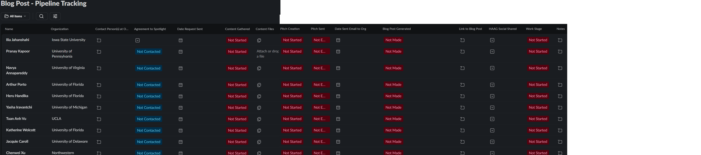

# Procedure: Slack-Based Blog Post Pipeline Tracker

## Related Procedure
This tracker serves as the primary operational tool for managing the workflow defined in the Blog Post Outreach Process. The blog post process it is built on was made by Neelima Pandey, and not the Summer 2026 managers. It is not found within the github since its not our work.

## Context and Participants
*   **Location:** Hosted as an interactive Slack List in the  `#haag-admin` Slack channel. https://humanaugmente-e7j6563.slack.com/lists/T071VTSFLCV/F0BJAHSV814?view_id=View0BJG9523PW
*   **Primary Users:** Jacob McGivern (Tracker developer), Neelima Pandey (Initiative Lead)
*   **Target Population:** All current and past Human-Augmented Analytics Group (HAAG) members (researchers, faculty affiliates, and computational advisors) who maintain active affiliations with external academic institutions or professional organizations.

## Tracker Purpose & Overview
The purpose of this tracker is to transition HAAG's lengthy external blog partnership process into a structured trackable project management pipeline. Because external outreach requires managing long feedback loops with university communications departments and writers whom HAAG does not control, this tracker was built to prevent active work from falling through the cracks. 

By using Slack Lists, the team can manage multiple candidate pipelines in tandem, providing a view of the status of every external collaboration at once.

---

## Tracker Visual Layout
*Below is the current visual setup of the Slack list as implemented in `#haag-admin`.*

 

---

## Tracker Database Schema (Columns & Selectable Values)
The Slack List is configured with the following columns:

| Column Name | Slack Field Type | Selectable / Value Options | Description |
|---|---|---|---|
| **Name** | Text | *Text* | Name of the HAAG member with external ties. |
| **Organization** | Text | *Text* | The external university or partner organization. |
| **Contact Person(s)** | Text | *Text* | Name and email of the PR representative or writer. |
| **Agreement to Spotlight** | Dropdown | `Not Contacted`   `Waiting for Response`   `Agreed`   `Declined` | Tracks internal researcher consent before external outreach. |
| **Date Request Sent** | Date | *Calendar Date* | Date the initial internal consent message was sent. |
| **Content Gathered Status**| Dropdown | `Not Started`   `In Progress`   `Completed`   `Awaiting more Information` | Tracks if bios, project files, and photos have been received. |
| **Content Files** | Files | *Slack File Attachment* | Graphics, figures, headshots, drafts, bios. |
| **Pitch Creation Status** | Dropdown | `Not Started`   `In-Progress`   `Need More Information`   `Completed`| Tracks drafting of custom pitch utilizing core templates. |
| **Pitch Sent Status** | Dropdown | `Not Emailed`   `Sent, Awaiting Response`   `Sent, Need to email back`   `Agreement Made!` | Tracks if the formal pitch has been emailed to the writer. |
| **Date Sent to Org** | Date | *Calendar Date* | Date the pitch email was officially sent to the external contact. |
| **Blog Post Generated** | Dropdown | `Not Made`   `Awaiting Organization to make`   `Blog Post Generated` | Status of the partner organization's article development. |
| **Link to Blog Post** | URL | *URL Hyperlink* | Live URL link to the published partner blog post. |
| **HAAG Social Shared** | Multi-select | `LinkedIn`   `Slack`   `Website` | Checkboxes tracking where the live story has been shared. |
| **Work Stage** | Dropdown | `Not Started`   `In-Progress`    `Completed` | Overall workflow state for quick filtering. |
| **Notes** | Long Text | *Text* | Space for any relevant notes for this pipeline follow-up logs. |

---

## Outcomes
Blog posts currently only has one active person of interest. Neelima hasn't used the tracker to catch up to its current state in the pipeline. However, it was showcased to her. Her notes indicated:
*   **Consolidation of Contacts:** The tracker successfully mapped out HAAG members with external ties
*   **Asynchronous:** The tracker is embedded directly in `#haag-admin`anyone can check the status  asynchronously,
*   **Big Picture:** With a bigger pipeline, its easy to see all status'.

### What Worked:

*   **Centralized File Management:** Attaching all information directly to the **Content Files** column in Slack kept everything in one place, preventing files from being lost in local folders or buried in chat histories.

## Contributors
*   **Jacob McGivern** - Built and implemented Slack Tracker
