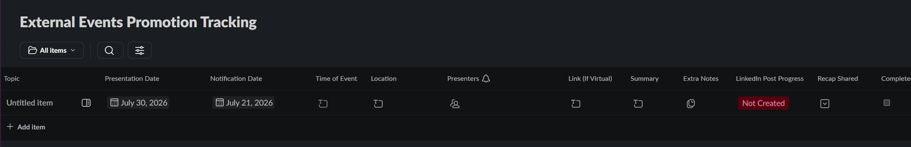

# Slack-Based External Event Tracker & LinkedIn Promotion Flow

## Related Procedure
This tracker is the primary operational tool used for tracking external research presentations and managing the "Before & After" LinkedIn promotion pipeline defined in the External Event Promotion Process.

## Context and Participants
*   **Location:** Hosted as an interactive Slack List inside the `#haag-admin` Slack channel, with drafting and verification reviews conducted in the `#post-feedback` channel before posting live to the official HAAG LinkedIn page. Link to list: https://humanaugmente-e7j6563.slack.com/lists/T071VTSFLCV/F0BK3ET8KNH?view_id=View0BK3ETCV0D
*   **Primary Users:** Any member of HAAG attending an external event and the admin who is making LinkedIn posts.
*   **Target Population:** All active HAAG student researchers, faculty affiliates, and computational advisors presenting papers, hosting workshops, or speaking at academic conferences

## Tracker Purpose & Overview
Because we operate as a virtual, online research organization, HAAG members may present in external locations and we lack a structured mechanism to capture these events in advance.

---

## Tracker Database Schema (Columns & Field Types)
The Slack List is configured with the following columns to manage the external event pipeline:

| Column Name | Slack Field Type | Selectable / Value Options | Description |
|---|---|---|---|
| **Topic** | Text | *Text* | The title of the paper or focus of the presentation |
| **Event Date** | Date | *Calendar Date* | The scheduled date of the  presentation or workshop |
| **Notification Date** | Date | *Calendar Date* | The date to broadcast a notification about the event |
| **Time of Event** | Text | *Text* | The time of the session (with timezone). |
| **Location** | Text | *Text* | The name of the conference or physical venue |
| **Presenters** | People | *Select Person within HAAG Slack* | Dropdown menu select to tag and credit the specific HAAG member(s) presenting. |
| **Link (if virtual)** | Text | *Text* | Direct link to the conference registration page or virtual session (if virtual). |
| **Summary** | Text | *Text* | Information about the presentation |
| **Extra Notes** | Text | *Text* | Extraneous information needed for posts |
| **LinkedIn Post Progress** | Dropdown | `Not Created`   `Draft`   `HAAG Review`   `Posted` | Tracks post leading up to event |
| **Recap Shared** | Dropdown | `Not Started`   `Draft`   `HAAG Review`   `Posted`| Tracks progress of the "Before" LinkedIn post through the `#post-feedback` channel. |
 **Completed** | Checkmark | *Check or Unchecked* | Used for easier filtering of past events |

---

## Promotion Flow

### 1. Sourcing information through the tracker
When an upcoming presentation is identified, the researcher logs the **Topic**, **Event Date**, **Time of Event**, **Location**, **Presenters**, and **Link (if virtual)** into the Slack tracker. The social media coordinator immediately reaches out to the presenter to request a visual and ensures the tracker is filled with all information needed for a post

### 2. Announcing the Event
 The post is made following the External Event Promotion Procedure.

### 3. Event Occurs
The researcher should acquire a picture from the event and post a summary into the tracker

### 4. Post-Event Recap
1. Following the presentation, the social media coordinator asks the researcher for a photo taken at the actual event.
2. The PM drafts a recap post.
3. Update the tracker. 

---

## Outcomes and Evidence
Currently there has been no documented external events in the past and no upcoming events. This is put into place for future needs. 

## Challenges and Limitations
* Ensuring people know this is available

---

## Contributors
*   **Jacob McGivern**  — Designed external event promotions tracker