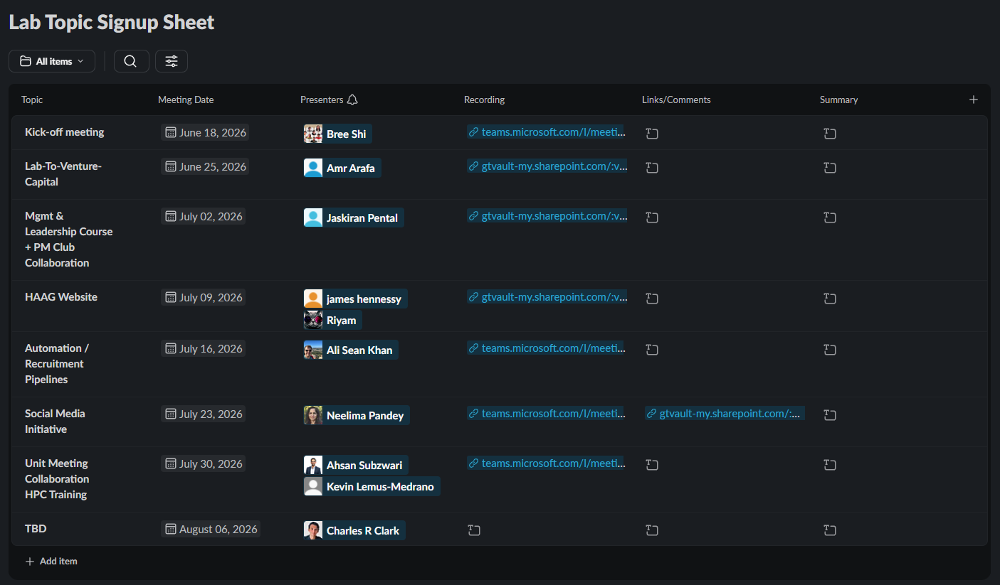
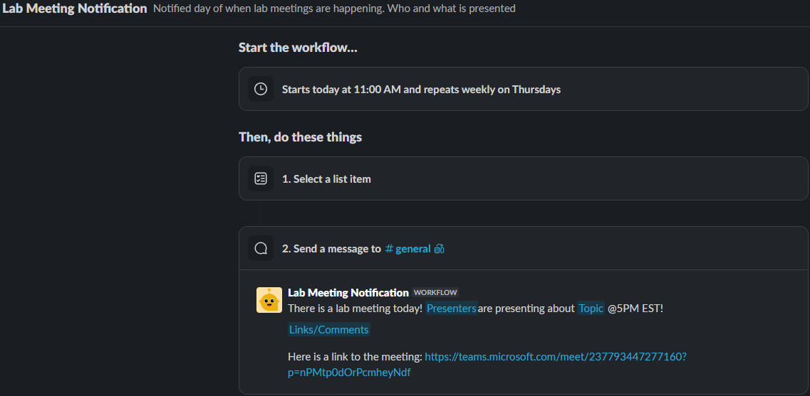

# Slack-Based Internal Lab Meeting Tracker & Automation

## Related Procedure
This tracker serves is used for tracking Lab events that currently occur every Thursday. It also contains a workflow for posting automatically the day of the meeting in #general chat in Slack.
Link to Workflow: https://slack.com/shortcuts/Ft0BL8GTBK2L/77873f0a8269a70d468043d74222c7fb
Link to Tracker: https://humanaugmente-e7j6563.slack.com/lists/T071VTSFLCV/F0BJ6Q19F0T?view_id=View0BJD22KKNW

## Context and Participants
*   **Location:** Hosted as an interactive Slack List inside the `#haag-admin` Slack channel, with automated outputs broadcasted to the `#general` channel.
*   **Primary Users:** Currently set Charlie as owner of the workflow.
*   **Target Population:** All admins who participate in Lab meetings.

## Tracker Purpose & Overview
Historically, HAAG's weekly lab meetings were managed via a static sign-up table. This format made it difficult to keep track of upcoming presenters, often resulted in low internal attendance, and required project managers to send manual reminders every single week. 

To resolve this, we transitioned the table to a  Slack List. This way of tracking has a benefit of using workflows on it. Slack does not enable workflows on tables. This enables a better UI and appropriate announcements.

---

## Tracker Database Schema (Columns & Field Types)
The Slack List is configured with the following columns to manage the internal meeting pipeline:

| Column Name | Slack Field Type | Selectable / Value Options | Description |
|---|---|---|---|
| **Topic** | Text | *Text* | Title of Presentation |
| **Meeting date** | Date | *Calendar Date* | The scheduled date for the lab meeting. |
| **Presenters** | People | *Select Person within HAAG Slack* | Dropdown menu select all members leading the session. |
| **Recording** | Link | *Text with URLs* | Direct link  recording of the session |
| **Links/Comments** |  Text | *Text with URLs* | Space for linking to the presentation slides (PPT) |
| **Summary** |  Text | *Text* | Any assigned action items |

---

## Implementation Approach & Automation Flow
Instead of relying on manual posts, our team implemented an alert post  utilizing Slack Workflow Builder to automate internal event promotion:

### How the Flow Works:
1. **Sign-up:** Team members sign up to present on a lab topic and populate their presentation details (Topic, Meeting date, and Presenters) directly in the Slack List tracker.
2. **Scheduled Check (Every Thursday Morning):** The automation workflow triggers automatically every Thursday morning. It queries the Slack List to check if there is an entry where the "Meeting date" matches that day's date.
3. **Automated Announcement Broadcast:** If a meeting is scheduled for that day, the workflow automatically pulls the designated presenter and topic fields from the row and broadcasts a formatted message to the `#general` channel.

---

## Outcomes and Evidence
*   **Increased Community Engagement:** Broadcasting automated alerts the morning of a meeting increases attendance at weekly virtual meetings
*   **Time Savings** Presenters do not need to manually post before the meeting to remind HAAG members about the Lab meeting.
*   **Ensure access:** Linking the meeting to the post ensures people can access the meeting.

## Challenges and Limitations
*   **Limited Notification** It can only post on the exact time the workflow runs. We cannot look ahead to post the day before the meeting.

## Next Steps for Future Cohorts

*  **Asynchronous Summary Generation:** Automate a post-meeting summary and post the summary in the Slack tracker. Anyone who missed the session can get a 3-sentence overview of the meeting directly in Slack.

---

## Contributors
*   **Jacob McGivern** (Designed strategy, tracker, and notification workflow)
